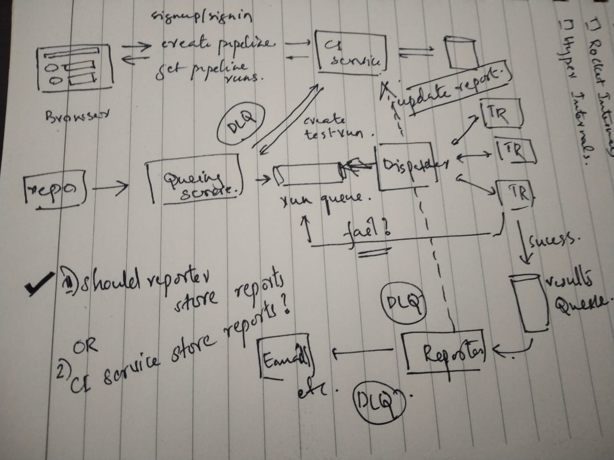

# Simple CI

## Basic Workflow

- User creates account
- Creates a new Integration Pipeline
  - Github link and some configuration
- User can see the pipeline status
- New commits to repo triggers a pipeline run event
- User can see the current status and past 5 status?
- Advanced features
  - Organization
  - Roles
  - Metrics
  - Pipeline parallelisation
  - Control Plane vs Data Plane?

## What happens behind the scenes

- User adds github repo, and configures callback
- Queuing Service handles the callback and adds the task run to queue. It also does a Create in DB
- Dispatcher manages all the TaskRunners
- Dispatcher polls from Queue when new taskRunner is available
- Error handling?
- TaskRunners push results to Queue
- Reporter polls the queue and updates the Run status

## Components

- CI Service
- Queuing service
- Dispatcher
- TaskRunner
- Reporter

## Stack

- Go + Gin for API server
- React for frontend
- Go for other intermediate applications
- MongoDB for storage
- Docker

## Packages

1. `ci-service`

    Serves as the API to CI system.

1. `ci-webapp`

    Web application in react. This only interacts with `ci-service`

1. `queueing-service`

    This service handles the repo update callbacks

1. `dispatcher`

    Manages task-runners and dispatches new tasks

1. `task-runner`

    Runs tests for the repo in a docker container.

1. `reporter`

    Reports test outcomes to `ci-service` and other sources.

## Architecture Overview

